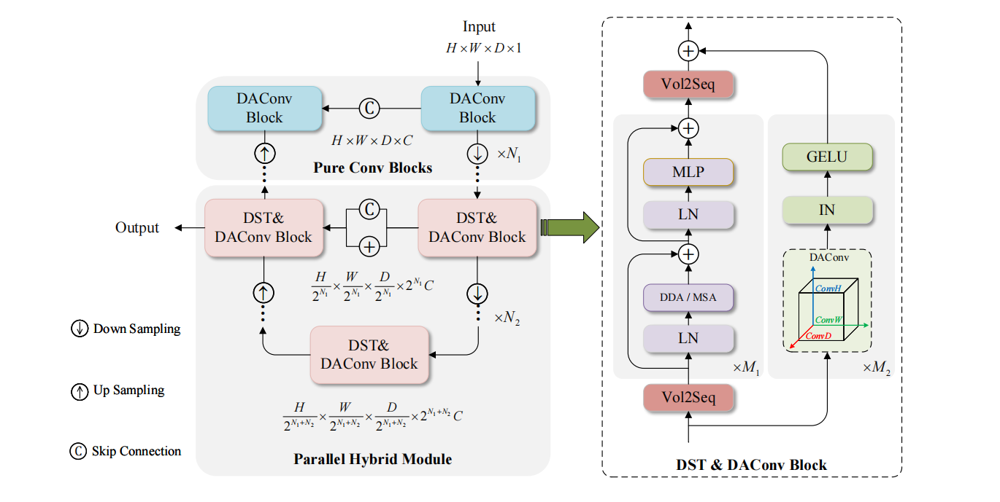

# Joint Parallel Modeling with Direction-Wise Convolution and Deformable Transformer for 3D Medical Image Segmentation

This is the code for paper "Joint Parallel Modeling with Direction-Wise Convolution and Deformable Transformer for 3D Medical Image Segmentation". The model is implemented with PyTorch.

# Abstruct

Three-dimensional (3D) medical images often exhibit anisotropic voxel spacing and complex organ shapes, making accurate segmentation challenging. Conventional CNNs are limited in addressing these challenges because they rely on fixed, isotropic kernels that cannot adapt to directional variations in resolution. While recent CNN-transformer hybrids have shown potential, their sequential integration of convolution and transformer blocks limits the joint modeling of local details and global context. To overcome these limitations, we propose PDAtrans (Parallel Direction-wise Aggregate Network), which constructs local and global representations in parallel through convolutional and transformer branches. The convolutional branch employs Direction-wise Aggregate Convolution (DAConv) to decouple spatial filtering across different directions, effectively addressing anisotropy. The transformer branch introduces a Direction-wise Shift Window Deformable Transformer (DST) that enables anatomy-aware adjustment of attention regions via learned offsets and enhances alignment with complex anatomical structures. Evaluated on three public 3D medical image datasets, PDAtrans achieves state-of-the-art performance with significantly lower computational cost. Ablation studies confirm the effectiveness of our direction-wise modules in enhancing segmentation under real-world constraints.

# Pipline

<div align="center">
  
</div>

# Usage

## Environment

```
git clone https://github.com/hzyBupt/PDAtrans

```
Change the dataset folders in setPATH.sh .
```
export nnUNet_raw="/ai/data/nnUNet_raw/"
export nnUNet_preprocessed="/ai/data/nnUNet_preprocessed/"
export nnUNet_results="/ai/code/nnUNet_results/"
export PYTHONPATH=/ai/code/nnUNet/nnunetv2:$PYTHONPATH
```
```
source setPATH.sh
source ~/.bashrc
```
## Dataset

The dataset can be downloaded from [WORD](https://github.com/HiLab-git/WORD) .

## Training

CUDA_VISIBLE_DEVICES=1 python nnunetv2/run/run_training.py 180 3d_fullres 0 -wm offline -cn PHTransv3 

## Testing

Pre-trained models can be downloaded from [GoogleDrive](https://drive.google.com/file/d/1j8R9vYCYs_q-_2VgqO1llClV7BHH_Hxd/view?usp=sharing).

Example usage:

    python nnunetv2/inference/predict_from_raw_data.py -d 180 -f 0 -ei nn-UNet_240424_102628
    python nnunetv2/custom_evaluation/abdominal_organs_eval.py
    
# Acknowledgement

The style of coding is borrowed from [nnUNet](https://github.com/MIC-DKFZ/nnUNet) and partially built upon the [PHTrans](https://github.com/lseventeen/PHTrans). We thank the authors for sharing their codes.

# Contact

If you have any question, please contact me (He Ziyang) via heziyang@bupt.edu.cn.
